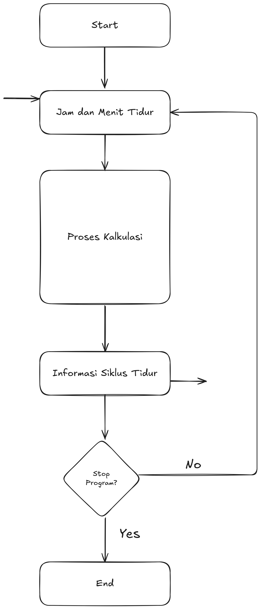
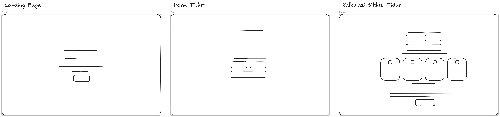
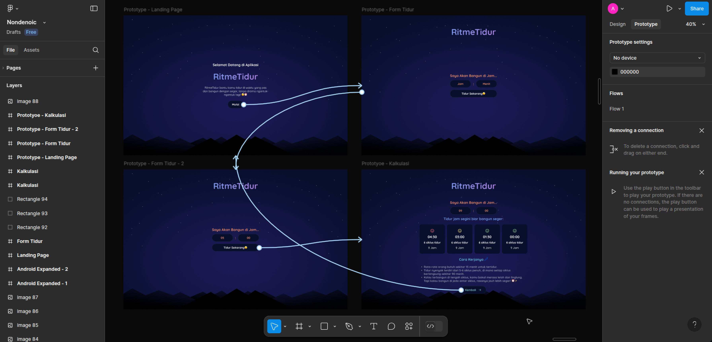

# Prototype RitmeTidur

Adi Muhammad Syifai

2309106065

Jum’at, 28 Maret 2025

---

### 📌 **1. 5W + 1H**

| Aspek | Penjelasan |
| --- | --- |
| **What** | Aplikasi desktop berbasis kalkulator yang membantu pengguna menghitung waktu tidur ideal berdasarkan siklus tidur manusia. |
| **Why** | Karena banyak orang mengalami masalah tidur dan kurang tahu kapan waktu terbaik untuk tidur agar bangun dalam keadaan segar. |
| **Who** | Remaja, mahasiswa, pekerja kantoran, dan siapa pun yang ingin meningkatkan kualitas tidur. |
| **Where** | Digunakan di perangkat pribadi seperti laptop, sebelum tidur. |
| **When** | Digunakan ketika pengguna ingin merencanakan waktu tidur untuk bangun pada jam tertentu. |
| **How** | Pengguna memasukkan jam bangun, lalu aplikasi menghitung waktu tidur yang ideal berdasarkan siklus tidur 90 menit. |

---

### 🧭 **2. UX Step (Design Thinking)**

| **Tahap** | **Aktivitas** |
| --- | --- |
| **Research** | Studi literatur tentang siklus tidur, wawancara pengguna, dan benchmarking aplikasi serupa. |
| **Emphatize** | Menggali kebutuhan pengguna dengan membuat empathy map dan user persona. Fokus pada masalah umum: sulit bangun pagi dan tidur tidak nyenyak. |
| **Create** | Mendesain antarmuka aplikasi RitmeTidur. Menyusun wireframe dan skenario penggunaan berdasarkan kebutuhan nyata. |
| **Test** | Melakukan uji coba awal pada beberapa user (mahasiswa, pekerja) dan meminta feedback apakah aplikasinya mudah digunakan dan membantu. |
| **Develop** | Mengembangkan aplikasi dengan Python Tkinter. Hasil akhir siap digunakan dan bisa diperbaiki dari hasil uji coba. |

---

### 🔍 **3. Research**

### a. Studi Literatur

- Tidur terdiri dari beberapa siklus ~90 menit.
- Bangun di tengah siklus tidur dapat menyebabkan kelelahan dan pusing.

### b. Observasi & Wawancara Singkat

- Mayoritas mahasiswa tidak tahu tentang siklus tidur.
- Mereka sering begadang dan merasa lelah saat bangun pagi.
- Tertarik dengan tools cepat untuk bantu atur tidur.

---

### 🧠 **4. Empathy Map**

| **Says** | **Thinks** |
| --- | --- |
| "Saya susah banget bangun pagi."
"Tidur lama tapi tetap capek."
"Mau coba cara biar tidur lebih nyenyak.”
"Harus bangun pagi, tapi selalu telat." | "Kenapa ya tidur saya nggak nyenyak?"
"Apa ada cara biar bangun nggak ngantuk?"  "Kayaknya harus coba aplikasi buat atur siklus tidur." 
"Apakah ini beneran bakal membantu?” |

| **Does** | **Feels** |
| --- | --- |
| Mencari info tentang pola tidur di Google.
Menggunakan alarm berkali-kali untuk bangun.
Minum kopi atau teh untuk mengurangi kantuk.
Tidur tidak teratur dan sering begadang. | Frustrasi karena susah bangun pagi.
Lelah sepanjang hari akibat tidur kurang berkualitas.
Penasaran apakah ada solusi yang lebih efektif.
Senang jika menemukan cara yang benar-benar membantu. |

---

### 👤 **5. User Persona**

### 🏷 **1. Yui – Mahasiswi Sibuk**

Yui adalah seorang mahasiswi tingkat akhir di Jakarta yang sering begadang untuk mengerjakan skripsi dan tugas kuliah. Ia sering merasa lelah di pagi hari karena tidurnya tidak teratur dan ingin menemukan cara agar bisa bangun segar tanpa harus menekan tombol snooze berkali-kali.

- **Motivation:** Ingin tetap produktif tanpa merasa kelelahan karena kurang tidur.
- **Needs/Desire:** Aplikasi sederhana yang bisa memberi rekomendasi waktu tidur yang efektif.
- **Frustration:** Sering bangun dalam keadaan pusing dan lelah meskipun sudah tidur cukup lama.

---

### 🏷 **2. Chloe – Pekerja Kantoran**

Chloe adalah seorang pegawai startup di Bandung yang sering pulang larut malam dan sulit mendapatkan tidur yang cukup. Ia ingin meningkatkan produktivitasnya dengan tidur lebih berkualitas serta mengurangi stres akibat pola tidur yang buruk.

- **Motivation:** Ingin meningkatkan produktivitas dengan tidur lebih berkualitas.
- **Needs/Desire:** Aplikasi yang bisa menyesuaikan jadwal tidur dengan fleksibel.
- **Frustration:** Sulit tidur cepat karena beban kerja tinggi dan sering merasa kelelahan.

---

### 🏷 **3. Lusi – Content Creator**

Lusi adalah seorang YouTuber dan influencer di Surabaya dengan jadwal kerja yang tidak menentu. Ia sering mengalami kesulitan dalam menjaga pola tidur yang sehat dan mencari cara agar bisa tetap mendapatkan tidur berkualitas meskipun jam tidurnya tidak teratur.

- **Motivation:** Mencari cara agar bisa tidur lebih baik meskipun jadwal kerja tidak menentu.
- **Needs/Desire:** Aplikasi yang bisa menghitung waktu tidur berdasarkan kapan ia bisa tidur.
- **Frustration:** Susah menyesuaikan waktu tidur dengan jadwal kerja yang berubah-ubah.

---

### 🏷 **4. Coco – Pelajar SMA**

Coco adalah seorang siswa kelas 12 di Yogyakarta yang sering begadang untuk belajar atau bermain game. Ia ingin bisa bangun pagi untuk sekolah tanpa merasa mengantuk serta meningkatkan nilai akademiknya dengan tidur yang lebih berkualitas.

- **Motivation:** Ingin bisa bangun pagi untuk sekolah tanpa merasa ngantuk.
- **Needs/Desire:** Kalkulator tidur yang bisa disesuaikan dengan jam sekolahnya.
- **Frustration:** Sering ketiduran saat belajar dan sulit bangun pagi meskipun sudah memasang alarm banyak kali.

---

### 🏷 **5. Raana – Dokter Muda**

Raana adalah seorang dokter muda di Semarang yang memiliki jadwal kerja padat dan sering mendapat shift malam di rumah sakit. Karena jadwalnya yang tidak menentu, ia sering mengalami kesulitan dalam mengatur waktu tidur yang cukup dan ingin menemukan cara agar tetap bisa beristirahat dengan optimal meskipun waktu tidurnya terbatas.

- **Motivation:** Ingin mendapatkan tidur yang lebih berkualitas di sela-sela jadwal kerja yang padat.
- **Needs/Desire:** Aplikasi yang bisa membantunya menghitung waktu tidur terbaik sesuai jadwal shift-nya.
- **Frustration:** Sering merasa kelelahan karena jadwal tidur yang tidak teratur dan sulit mendapatkan istirahat yang cukup.

---

### 📖 **6. Skenario Penggunaan**

**Skenario 1**

Yui ingin bangun jam 6 pagi untuk kuliah. Ia buka aplikasi RitmeTidur, memasukkan jam 06:00, lalu melihat rekomendasi jam tidur terbaik seperti 20:30 atau 22:00. Ia memilih tidur pukul 22:00 agar dapat 6 siklus tidur.

**Skenario 2**

Chloe pulang kerja jam 18:00 dan ingin tidur cepat agar segar. Ia atur aplikasi untuk bangun pukul 5:00 pagi dan mengikuti waktu tidur yang direkomendasikan.

---

### 🎞️ **7. Storyboard**

| No | Ilustrasi (Deskripsi) | Penjelasan |
| --- | --- | --- |
| 1 | Yui merasa pusing tiap bangun pagi | Muncul kesadaran untuk mencari solusi |
| 2 | Yui browsing dan menemukan RitmeTidur | Menemukan solusi |
| 3 | Ia memasukkan waktu bangun jam 06:00 | Input sederhana dan cepat |
| 4 | Aplikasi menampilkan rekomendasi jam tidur | Terdapat label "emoji hijau" |
| 5 | Yui mengikuti waktu tidur itu dan bangun segar | Solusi berhasil digunakan |

---

### ➡️ 8**. Flowchart**

---

### 🪟 9**. Wireframe**

---

### 🎨 10. Design & Prototype

---

Written using Notion by Adi Muhammad Syifai
